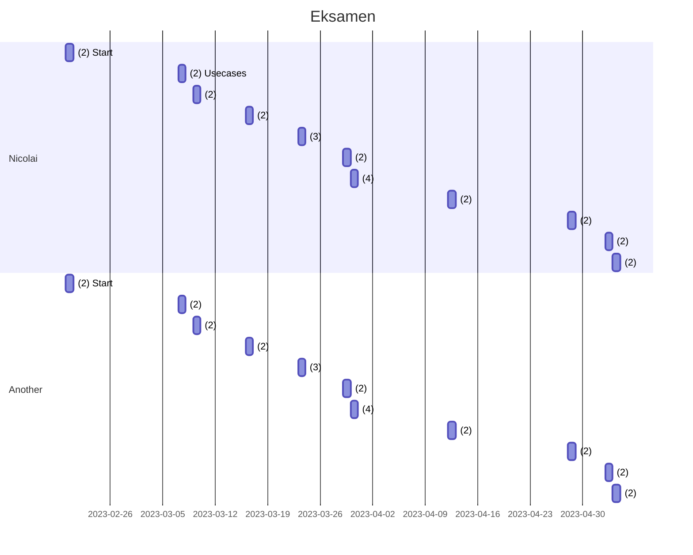

# EksamensProjekt2023

# Synopsis

# Planen

```mermaid
gantt
    title Eksamen
    dateFormat YYYY-MM-DD
    section Nicolai
      (2) Start            : 2023-02-20, 1d 
      (2) Usecases         : 2023-03-07, 1d 
      (2)                  : 2023-03-09, 1d 
      (2)                  : 2023-03-16, 1d 
      (3)                  : 2023-03-23, 1d 
      (2)                  : 2023-03-29, 1d 
      (4)                  : 2023-03-30, 1d 
      (2)                  : 2023-04-12, 1d 
      (2)                  : 2023-04-28, 1d 
      (2)                  : 2023-05-03, 1d 
      (2)                  : 2023-05-04, 1d 
    section Another
      (2) Start            : 2023-02-20, 1d 
      (2)                  : 2023-03-07, 1d 
      (2)                  : 2023-03-09, 1d 
      (2)                  : 2023-03-16, 1d 
      (3)                  : 2023-03-23, 1d 
      (2)                  : 2023-03-29, 1d 
      (4)                  : 2023-03-30, 1d 
      (2)                  : 2023-04-12, 1d 
      (2)                  : 2023-04-28, 1d 
      (2)                  : 2023-05-03, 1d 
      (2)                  : 2023-05-04, 1d 


```

## SDLC

## Usecases
## Usecase diagram

## Klasse diagram

## Implementaion

## Test

* Blackbox / System testing
